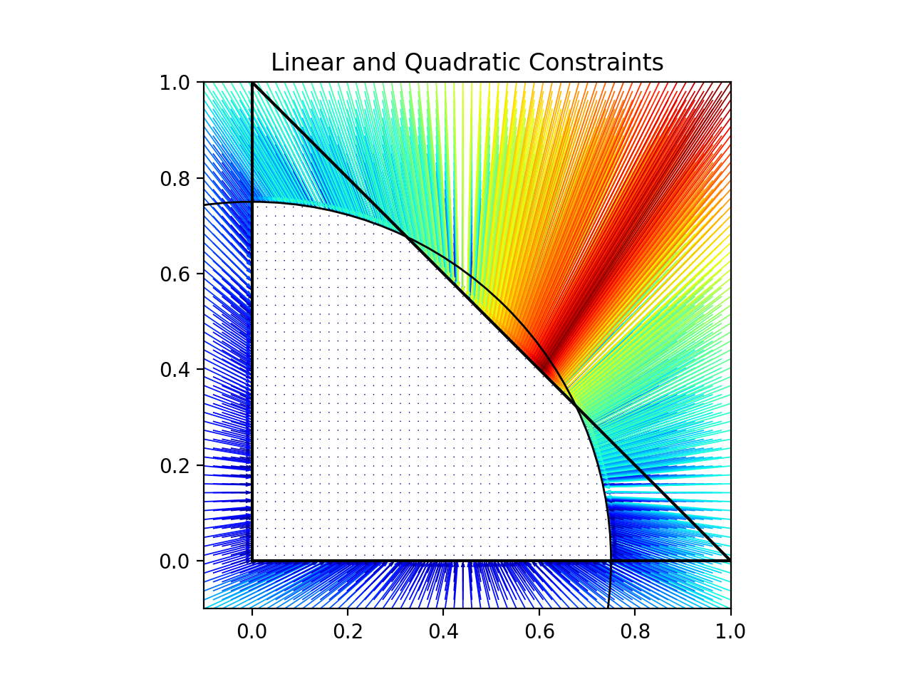

# ConstraiNet

A PyTorch implementation of ConstraiNet – differentiable output constrained neural network layer.

This repository includes a python package, containing:

- `ConstraiNetLayer` – a neural network layer with (hard) constrained output;
- Simple Feed-Forward `DenseConstraiNet` – easy-to-use neural network with constrained output;
- `test_runner` – a simple testing platform for evaluation of different layer implementations on optimization tasks;
- Utility methods for problems generation, etc.;
- Other less successful neural network layers & models for constraining output (considered during research).

## Usage

The most successful models in the package are `ConstraiNetLayer` and `DenseConstraiNet`.

A `ConstraiNetLayer` is a layer that generates output vectors only inside the domain.
The domain is determined by a constraint set, which can be constructed with:

- `LinearConstraints(A, b)` – linear **inequality** constraints of form `A x <= b`;
- `LinearEqualityConstraints(A, b)` – linear **equality** constraints of form `A x == b`;
- `QuadraticConstraints(P, q, b)` – quadratic inequality constraints of form `x^T P_i x + q^T_i x <= b_i`.

To create a `ConstraiNetLayer` just pass a list of constraints (also you can pass only one constraints instance, or a `ConstraintSet`):

```python
from constrainet import (
    LinearConstraints,
    QuadraticConstraints,
    ConstraiNetLayer,
    DenseConstraiNet,
)

c_layer = ConstraiNetLayer(
    constraints=[
        # a triangle
        LinearConstraints(
            A=np.array([[-1., 0.], [0., -1.], [1., 1.]]),
            b=np.array([0., 0., 1.]),
        ),
        # a circle
        QuadraticConstraints(
            P=2.0 * np.eye(2, dtype=np.float64)[np.newaxis],
            q=np.zeros((1, 2), dtype=np.float64),
            b=(0.75 ** 2) * np.ones((1,), dtype=np.float64)
        )
    ],
    mode='center_projection',  # or 'ray_shift'
)
```

Here is an example of mapping created by this layer:


The layer `c_layer` will take vectors of dimension `(batch_size, c_layer.n_inputs)` as input
and will return constrained vectors of dimension determined by the given constraints.

Note, that `c_layer.n_inputs` depends on layer *mode*, which may be one of:

- 'center_projection' – then the number of inputs is the same as output vector dimension;
- 'ray_shift" – then the number of inputs is `n_features + 1`.

To be able to easily handle different modes, we provide simple dense network with constrained output –
`DenseConstraiNet`.
It consists of a feed-forward network and a `ConstraiNetLayer` at the end,
and it automatically decides what number of inputs should be passed to the `ConstraiNetLayer`:

```python
nn = DenseConstraiNet(
    input_dim=input_dim,             # number of input features
    hidden_dim=config.nn_hidden_dim,  # width of hidden layers
    n_layers=config.nn_n_layers,      # number of hidden layers
    constraints=constraints,         # list of constraints
    mode='center_projection',        # ConstraiNetLayer mode (another option: 'ray_shift')
)
```

*For convenience it is possible to pass multiple separate `LinearConstraints`, `QuadraticConstraints` in arbitrary order.*

## Installation

### Development

*Currently the package is at the development stage, so it cannot be installed from PyPI.*

We use [Hatch](https://github.com/pypa/hatch) for project management,
but we believe that the package can be easily converted for use with any other tool, like Poetry.

1. Install [Hatch](https://github.com/pypa/hatch).
2. Clone repository and go to the project directory.

    ```shell
    git clone https://github.com/andruekonst/ConstraiNet.git
    cd ConstraiNet
    ```

3. Create a Hatch environment.

    ```shell
    hatch env create
    ```

4. Activate Hatch shell.

    ```shell
    hatch shell
    ```

Now you can run any script that uses ConstraiNet.
